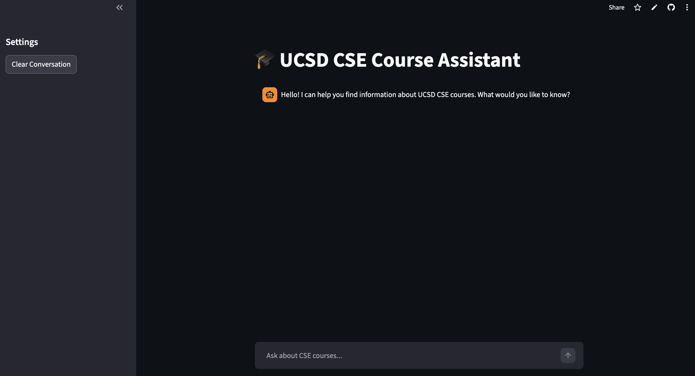

# UCSD CSE Course Assistant 🎓

A Retrieval-Augmented Generation (RAG) application designed to help UCSD students find information about Computer Science & Engineering (CSE) courses. This tool scrapes the UCSD course catalog, processes the data, and uses an AI agent to answer student queries with context-aware responses.




## 🚀 Features

- **RAG Architecture**: Retrieves relevant course data from the UCSD catalog to ground LLM responses in fact.
- **Hybrid Search**: Combines **Vector Similarity Search** (ChromaDB) with **Keyword Search** (BM25) for higher accuracy.
- **Reranking**: Uses **FlashRank** to re-order search results by relevance before sending them to the LLM.
- **Interactive UI**: Built with **Streamlit** for a chat-like experience.
- **Streaming Responses**: Real-time token streaming for a smoother user experience.

## 🛠️ Tech Stack

- **Frontend**: Streamlit
- **Orchestration**: LangChain
- **LLM & Embeddings**: OpenAI (`gpt-5-nano`, `text-embedding-3-small`)
- **Vector Database**: ChromaDB
- **Retrieval**: BM25 & FlashRank

## 📋 Prerequisites

- Python 3.11+
- An OpenAI API Key

## Try It Out!

- https://ucsd-rag-assistant-r9lpymztcygugwr5bdqeta.streamlit.app/

## ⚙️ Installation

1.  **Clone the repository**

    ```bash
    git clone https://github.com/Danny-jin/ucsd-rag-assistant.git
    cd ucsd-rag-assistant
    ```

2.  **Create a virtual environment (Optional but recommended)**

    ```bash
    python -m venv .venv
    source .venv/bin/activate  # On Windows use: .venv\Scripts\activate
    ```

3.  **Install dependencies**
    ```bash
    pip install -r requirements.txt
    ```

## 🔑 Configuration

1.  Create a `.env` file in the root directory.
2.  Add your OpenAI API key:
    ```env
    OPENAI_API_KEY=your_api_key_here
    ```

## ▶️ Usage

Run the Streamlit application:

```bash
streamlit run app.py
```
